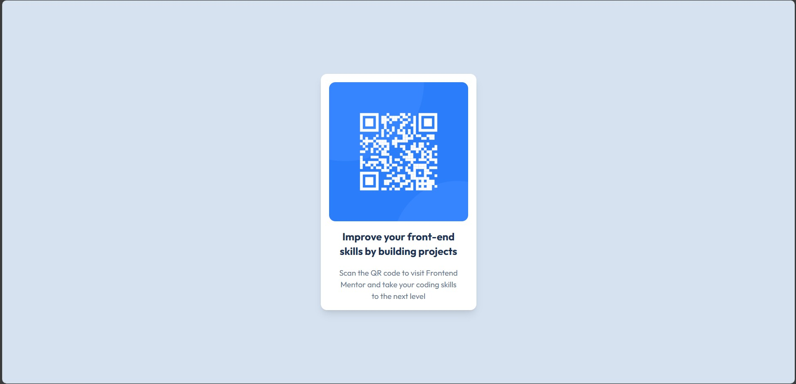

# Frontend Mentor - QR code component solution

This is a solution to the [QR code component challenge on Frontend Mentor](https://www.frontendmentor.io/challenges/qr-code-component-iux_sIO_H). Frontend Mentor challenges help you improve your coding skills by building realistic projects.

## Table of contents

- [Overview](#overview)
  - [Screenshot](#screenshot)
  - [Links](#links)
- [My process](#my-process)
  - [Built with](#built-with)
  - [What I learned](#what-i-learned)
  - [Continued development](#continued-development)
  - [Useful resources](#useful-resources)
- [Author](#author)
- [Acknowledgments](#acknowledgments)

## Overview

### Screenshot



Add a screenshot of your solution. The easiest way to do this is to use Firefox to view your project, right-click the page and select "Take a Screenshot". You can choose either a full-height screenshot or a cropped one based on how long the page is. If it's very long, it might be best to crop it.

Alternatively, you can use a tool like [FireShot](https://getfireshot.com/) to take the screenshot. FireShot has a free option, so you don't need to purchase it.

Then crop/optimize/edit your image however you like, add it to your project, and update the file path in the image above.

### Links

- Solution URL: [Add solution URL here](https://your-solution-url.com)
- Live Site URL: [Add live site URL here](https://your-live-site-url.com)

## My process

### Built with

- Semantic HTML5 markup
- CSS custom properties
- Flexbox
- CSS Grid
- Mobile-first workflow
- [TailwindCSS](https://tailwindcss.com/) - Tailwind CSS

### What I learned

This was my first time using TailwindCSS and I found it to be a very useful tool. I was able to create a responsive design with minimal CSS. I also learned how to extend custom theme in TailwindCSS simplifying the process of creating custom styles.

```js
tailwind.config = {
  theme: {
    extend: {
      fontFamily: {
        sans: ["Outfit", "sans-serif"],
      },
      colors: {
        white: "hsl(0, 0%, 100%)",
        slate: {
          300: "hsl(212, 45%, 89%)",
          500: "hsl(216, 15%, 48%)",
          900: "hsl(218, 44%, 22%)",
        },
      },
      fontSize: {
        paragraph: "0.9375rem",
      },
    },
  },
};
```

```html
<body class="bg-slate-300">
  <div class="h-screen w-screen flex items-center justify-center">
    <div
      class="p-4 bg-white shadow-lg rounded-xl max-w-[300px] flex flex-col gap-4"
    >
      <div>
        
      </div>
      <div class="flex flex-col gap-4 px-4">
        <div class="text-center">
          <h2 class="text-xl font-bold text-slate-900">
            Improve your front-end skills by building projects
          </h2>
        </div>
        <div class="text-center">
          <p class="text-paragraph text-slate-500">
            Scan the QR code to visit Frontend Mentor and take your coding
            skills to the next level
          </p>
        </div>
      </div>
    </div>
  </div>
</body>
```

### Continued development

I plan to continue using TailwindCSS in future projects. I found it to be a very useful tool for creating responsive designs with minimal CSS.

### Useful resources

- [Frontend Mentor](https://www.frontendmentor.io/) - This is an excellent resource for practicing HTML, CSS, and JavaScript. They provide a variety of challenges that range from easy to difficult. I highly recommend this site to anyone looking to improve their coding skills.

## Author

- Website - [Zahid Shaikh](https://www.zahidshaikh.space)
- Frontend Mentor - [@The-Lone-Druid](https://www.frontendmentor.io/profile/The-Lone-Druid)
- Github - [The-Lone-Druid](https://www.github.com/The-Lone-Druid)

## Acknowledgments

I would like to thank Frontend Mentor for providing this challenge. I learned a lot from this project and I look forward to completing more challenges in the future.
